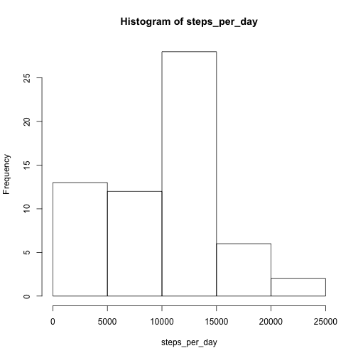
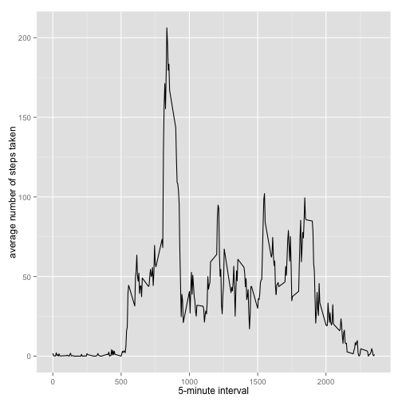
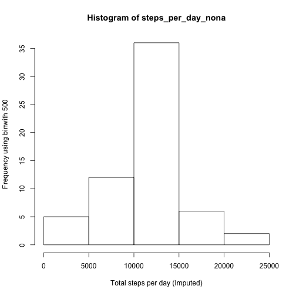
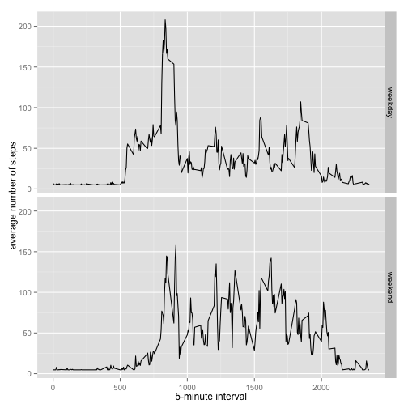

#Assignment
This is the solution of the Coursera's "Reproducible Research" ", Week 2 Peer Assignment 1.
You can download the dataset (activity.csv) here [1]
Before you start running the code, make sure to set your working directory to where the activity.csv file is located. 

##Loading and preprocessing the data
1. Load the data
2. Process/transform the data (if necessary) into a format suitable for your analysis


```r
if(!file.exists('activity.csv')) {
        unzip('activity.zip')
}
monitoring_data <- read.csv("activity.csv")
summary(monitoring_data)
```

```
##      steps                date          interval     
##  Min.   :  0.00   2012-10-01:  288   Min.   :   0.0  
##  1st Qu.:  0.00   2012-10-02:  288   1st Qu.: 588.8  
##  Median :  0.00   2012-10-03:  288   Median :1177.5  
##  Mean   : 37.38   2012-10-04:  288   Mean   :1177.5  
##  3rd Qu.: 12.00   2012-10-05:  288   3rd Qu.:1766.2  
##  Max.   :806.00   2012-10-06:  288   Max.   :2355.0  
##  NA's   :2304     (Other)   :15840
```

```r
head(monitoring_data)
```

```
##   steps       date interval
## 1    NA 2012-10-01        0
## 2    NA 2012-10-01        5
## 3    NA 2012-10-01       10
## 4    NA 2012-10-01       15
## 5    NA 2012-10-01       20
## 6    NA 2012-10-01       25
```

```r
tail(monitoring_data)
```

```
##       steps       date interval
## 17563    NA 2012-11-30     2330
## 17564    NA 2012-11-30     2335
## 17565    NA 2012-11-30     2340
## 17566    NA 2012-11-30     2345
## 17567    NA 2012-11-30     2350
## 17568    NA 2012-11-30     2355
```

```r
str(monitoring_data)
```

```
## 'data.frame':	17568 obs. of  3 variables:
##  $ steps   : int  NA NA NA NA NA NA NA NA NA NA ...
##  $ date    : Factor w/ 61 levels "2012-10-01","2012-10-02",..: 1 1 1 1 1 1 1 1 1 1 ...
##  $ interval: int  0 5 10 15 20 25 30 35 40 45 ...
```

##What is mean total number of steps taken per day?
For this part of the assignment, you can ignore the missing values in the dataset.
1. Calculate the total number of steps taken per day
2. If you do not understand the difference between a histogram and a barplot, research the difference between them. Make a histogram of the total number of steps taken each day
3. Calculate and report the mean and median of the total number of steps taken per day


```r
steps_per_day <- tapply(monitoring_data$steps, monitoring_data$date, sum, na.rm = TRUE)

hist(steps_per_day)
```

 

```r
steps_per_day_mean <- mean(steps_per_day)
steps_per_day_median <- median(steps_per_day)
```

Mean: {r steps_per_day_mean}
Median: {r steps_per_day_median}

#What is the average daily activity pattern? 
1. Make a time series plot (i.e. type = "l") of the 5-minute interval (x-axis) and the average number of steps taken, averaged across all days (y-axis)
2. Which 5-minute interval, on average across all the days in the dataset, contains the maximum number of steps?


```r
install.packages("ggplot2")
```

```
## Error in install.packages : Updating loaded packages
```

```r
library(ggplot2)

avg_steps_per_interval <- aggregate(x=list(mean_steps=monitoring_data$steps), by=list(interval=monitoring_data$interval), FUN=mean, na.rm=TRUE)

ggplot(avg_steps_per_interval, aes(x=interval, y=mean_steps)) + geom_line() + xlab("5-minute interval") + ylab("average number of steps taken")
```

 

```r
max_steps <- which.max(avg_steps_per_interval$mean_steps)
time_max_steps <- gsub("([0-9]{1,2})([0-9]{2})", "\\1:\\2", avg_steps_per_interval[max_steps, 'interval'])
```

Maximum number of steps at: {r time_max_steps}

#Imputing missing values
##1. Calculate and report the total number of missing values in the dataset (i.e. the total number of rows with NAs)


```r
total_missing_values <- length(which(is.na(monitoring_data$steps)))
```

Number of missing values: {r total_missing_values}

##2. Devise a strategy for filling in all of the missing values in the dataset. The strategy does not need to be sophisticated. For example, you could use the mean/median for that day, or the mean for that 5-minute interval, etc.

The stragey is to populate missing values with an average for that variable.

##3. Create a new dataset that is equal to the original dataset but with the missing data filled in.

```r
library(Hmisc)

monitoring_data_nona <- monitoring_data

monitoring_data_nona$steps <- impute(monitoring_data$steps, fun=mean)
```

##4. Make a histogram of the total number of steps taken each day and Calculate and report the mean and median total number of steps taken per day. Do these values differ from the estimates from the first part of the assignment? What is the impact of imputing missing data on the estimates of the total daily number of steps?

```r
steps_per_day_nona <- tapply(monitoring_data_nona$steps, monitoring_data_nona$date, sum)

hist(steps_per_day_nona, xlab="Total steps per day (Imputed)", ylab="Frequency using binwith 500", binwidth=500)
```

```
## Warning in plot.window(xlim, ylim, "", ...): "binwidth" is not a graphical
## parameter
```

```
## Warning in title(main = main, sub = sub, xlab = xlab, ylab = ylab, ...):
## "binwidth" is not a graphical parameter
```

```
## Warning in axis(1, ...): "binwidth" is not a graphical parameter
```

```
## Warning in axis(2, ...): "binwidth" is not a graphical parameter
```

 

##...and Calculate and report the mean and median total number of steps taken per day.


```r
steps_per_day_nona_mean <- mean(steps_per_day_nona)
steps_per_day_nona_median <- median(steps_per_day_nona)
```

Mean(imputed): {r steps_per_day_nona_mean}
Median(imputed): {r steps_per_day_nona_median}

##Are there differences in activity patterns between weekdays and weekends?

1. Create a new factor variable in the dataset with two levels – “weekday” and “weekend” indicating whether a given date is a weekday or weekend day.


```r
monitoring_data_nona$dateType <- ifelse(as.POSIXlt(monitoring_data_nona$date)$wday %in% c(0,6), 'weekend', 'weekday')
```

2. Make a panel plot containing a time series plot (i.e. type = "l") of the 5-minute interval (x-axis) and the average number of steps taken, averaged across all weekday days or weekend days (y-axis). See the README file in the GitHub repository to see an example of what this plot should look like using simulated data.


```r
avg_monitoring_data_nona <- aggregate(steps ~ interval + dateType, data = monitoring_data_nona, mean)

ggplot(avg_monitoring_data_nona, aes(interval, steps)) + geom_line() + facet_grid(dateType ~ .) + xlab("5-minute interval") + ylab("average number of steps")
```

 

[1] https://d396qusza40orc.cloudfront.net/repdata%2Fdata%2Factivity.zip
